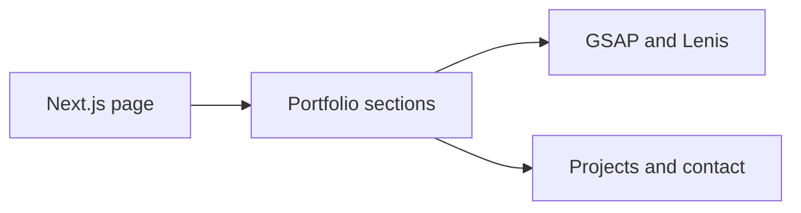

# Danush Arun — Portfolio

A browser-driven portfolio built with Next.js, React and TypeScript.
The page presents a personal manifesto, Mira, selected projects, numbers, a working formula and
contact.

## Experience and architecture

[page.tsx](src/app/page.tsx) assembles the sections as client-only dynamic imports.
A loader introduces the experience; a custom cursor and navigation frame the page.
GSAP ScrollTrigger coordinates scroll animation, while Lenis manages smooth scrolling.
The dependency manifest also includes Three.js and React Three Fiber for visual work.



## Run locally

```bash
git clone https://github.com/DanushArun/portfolio.git
cd portfolio
npm ci
npm run dev
```

Open `http://localhost:3000`. The manifest pins Next.js 16.2.4 and React 19.2.4.
Use a Node version compatible with the locked dependencies.

## Edit and verify

- [src/components](src/components): page sections and interaction components.
- [globals.css](src/app/globals.css): shared styling.
- [public](public): static assets.
- [screenshot-hero.mjs](tools/screenshot-hero.mjs): browser screenshot helper.

```bash
npm run lint
npm run build
npm start
```

Run `npm start` after a successful build. The manifest has no automated test script.
This README was checked against source and scripts; a browser or production build was not run
for this documentation update. Review keyboard navigation, reduced-motion behavior and mobile
performance before treating the animated experience as validated.
