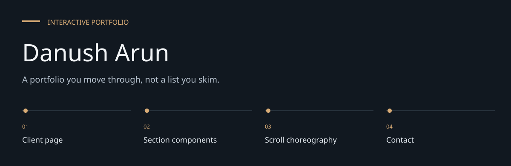
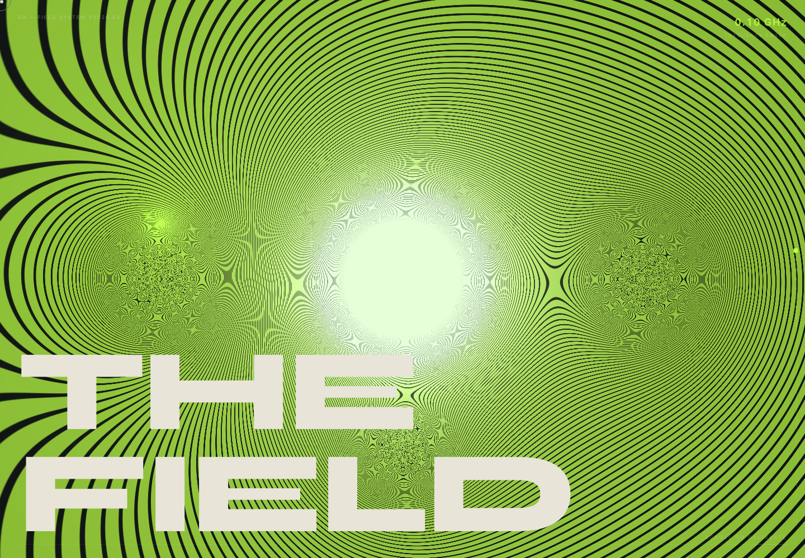
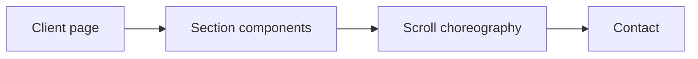
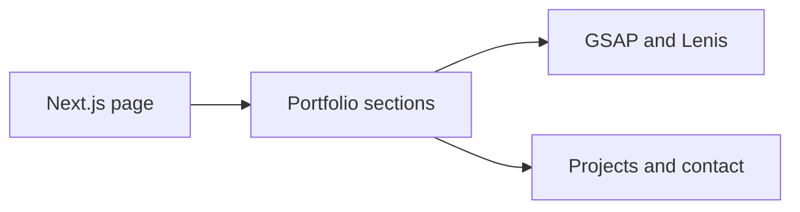

# Danush Arun

**A portfolio you move through, not a list you skim.**

A browser-driven portfolio built with Next.js, React and TypeScript.
The page presents a personal manifesto, Mira, selected projects, numbers, a working formula and
contact.


[Architecture](docs/ARCHITECTURE.md) · [Evaluation guide](docs/EVALUATION.md)

**Contents:** [The challenge](#the-challenge) · [Walkthrough](#walk-through-the-project) ·
[Implementation](#implementation-state) · [Design choices](#engineering-choices) ·
[Next evidence](#next-evidence-to-collect)

---

## The challenge

A portfolio has to communicate a point of view as well as show projects. This build uses a
continuous scroll journey to connect personal principles, selected work and contact, rather than
leaving the reader to infer that story from a grid of links.

## Browser preview



*Captured from the tracked website in Chromium on 7 October 2026. This is a local rendering, not a
claim about current public hosting.*

## System at a glance



## Walk through the project

### 1. Enter the experience

The client page mounts a loader, cursor and navigation before the portfolio sections. Inspect the
initial loading state before evaluating the full journey.

### 2. Follow the narrative

Move through Hero, Manifesto, Mira, Projects, Numbers and Formula. Each section is a separate
component; their ordering is defined by the page rather than a content service.

### 3. Inspect interaction

ScrollTrigger and Lenis coordinate movement. Check the page at a narrow viewport and with keyboard
navigation; visual animation alone does not establish usability.

### 4. Reach contact

The final contact component completes the journey. Verify its links and actions directly; this
repository does not show a separate contact API.

## Experience and architecture

[page.tsx](src/app/page.tsx) assembles the sections as client-only dynamic imports.
A loader introduces the experience; a custom cursor and navigation frame the page.
GSAP ScrollTrigger coordinates scroll animation, while Lenis manages smooth scrolling.
The dependency manifest also includes Three.js and React Three Fiber for visual work.



## Run locally

```bash
git clone https://github.com/DanushArun/portfolio.git
cd portfolio
npm ci
npm run dev
```

Open `http://localhost:3000`. The manifest pins Next.js 16.2.4 and React 19.2.4.
Use a Node version compatible with the locked dependencies.

## Edit and verify

- [src/components](src/components): page sections and interaction components.
- [globals.css](src/app/globals.css): shared styling.
- [public](public): static assets.
- [screenshot-hero.mjs](tools/screenshot-hero.mjs): browser screenshot helper.

```bash
npm run lint
npm run build
npm start
```

Run `npm start` after a successful build. The manifest has no automated test script.
This README was checked against source and scripts; the production build and a Chromium preview
passed in this documentation update. Review keyboard navigation, reduced-motion behavior and
mobile
performance before treating the animated experience as validated.

## Engineering choices

**Client-only sections.** Browser APIs drive the sections; the page disables SSR for them.

**Separate section components.** Narrative ordering stays visible in the page while section
behavior has its own source.

**Source-first evidence.** Dependency presence does not prove every animation library is active in
the shipped page.

## Implementation state

| State | Current evidence |
| --- | --- |
| Present | Narrative sections, loader, cursor and navigation |
| Present | GSAP/Lenis interaction source and screenshot helper |
| Not measured | Keyboard, reduced-motion and mobile usability |
| Not verified | Current production hosting and contact delivery |

The [architecture guide](docs/ARCHITECTURE.md) maps these statements to source entry points.
The [evaluation guide](docs/EVALUATION.md) separates inspection, executable checks and
domain validation, with the next evidence needed for each project.

## Next evidence to collect

- Capture desktop and mobile acceptance evidence.
- Verify reduced-motion and keyboard paths.
- Record deployment and contact behavior against the published site.

## Recorded checks — 7 October 2026

| Check | Observation |
| --- | --- |
| Production build | Passed; static page generated |
| Browser preview | Loaded without page errors; screenshot captured |

Commands used:

```text
npm run build
Chromium at 1440 × 1000
```

These results cover the listed software paths. They do not establish live deployment,
external-service compatibility, accessibility conformance or domain efficacy.
