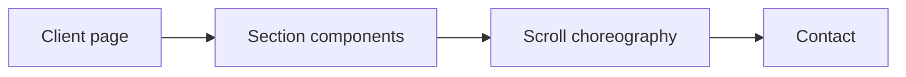

# Danush Arun — Architecture and implementation

This guide follows the tracked implementation. Proposed work is identified separately.

## The problem and the system boundary

A portfolio has to communicate a point of view as well as show projects. This build uses a
continuous scroll journey to connect personal principles, selected work and contact, rather than
leaving the reader to infer that story from a grid of links.

## Processing path

## End-to-end behavior

### 1. Enter the experience

The client page mounts a loader, cursor and navigation before the portfolio sections. Inspect the
initial loading state before evaluating the full journey.

### 2. Follow the narrative

Move through Hero, Manifesto, Mira, Projects, Numbers and Formula. Each section is a separate
component; their ordering is defined by the page rather than a content service.

### 3. Inspect interaction

ScrollTrigger and Lenis coordinate movement. Check the page at a narrow viewport and with keyboard
navigation; visual animation alone does not establish usability.

### 4. Reach contact

The final contact component completes the journey. Verify its links and actions directly; this
repository does not show a separate contact API.

## Design choices and consequences

### Client-only sections

Browser APIs drive the sections; the page disables SSR for them.

### Separate section components

Narrative ordering stays visible in the page while section behavior has its own source.

### Source-first evidence

Dependency presence does not prove every animation library is active in the shipped page.

## Source entry points

### [src/app/page.tsx](../src/app/page.tsx)

This file is part of the reviewed path described above. Follow its imports and calls
for the exact interface rather than inferring behavior from the filename.

### [src/components/Hero.tsx](../src/components/Hero.tsx)

This file is part of the reviewed path described above. Follow its imports and calls
for the exact interface rather than inferring behavior from the filename.

### [src/components/Projects.tsx](../src/components/Projects.tsx)

This file is part of the reviewed path described above. Follow its imports and calls
for the exact interface rather than inferring behavior from the filename.

### [src/components/Contact.tsx](../src/components/Contact.tsx)

This file is part of the reviewed path described above. Follow its imports and calls
for the exact interface rather than inferring behavior from the filename.

### [src/components/LenisProvider.tsx](../src/components/LenisProvider.tsx)

This file is part of the reviewed path described above. Follow its imports and calls
for the exact interface rather than inferring behavior from the filename.

## Implementation state

| State | Evidence boundary |
| --- | --- |
| Present | Narrative sections, loader, cursor and navigation |
| Present | GSAP/Lenis interaction source and screenshot helper |
| Not measured | Keyboard, reduced-motion and mobile usability |
| Not verified | Current production hosting and contact delivery |

“Present” means tracked source or assets exist. It does not mean a production or domain
validation has passed. See [Evaluation](EVALUATION.md) for reproducible checks and limits.
